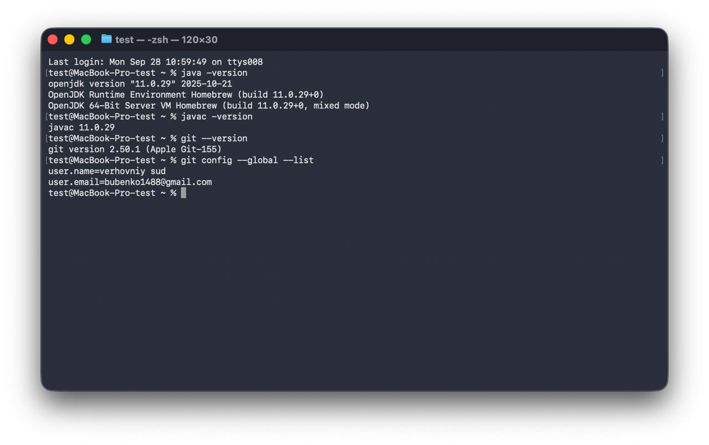
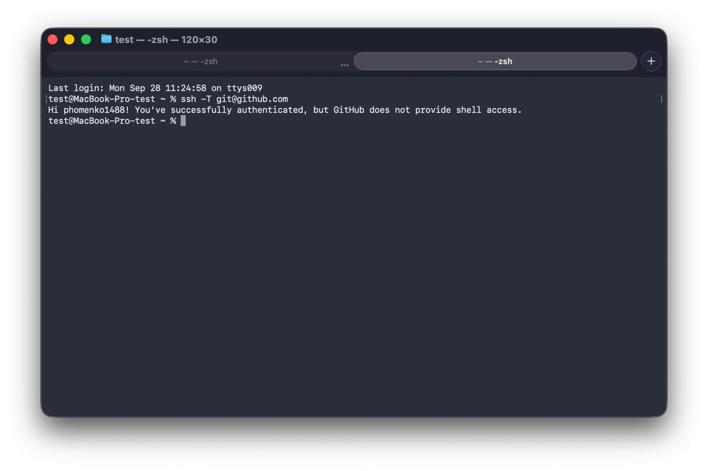
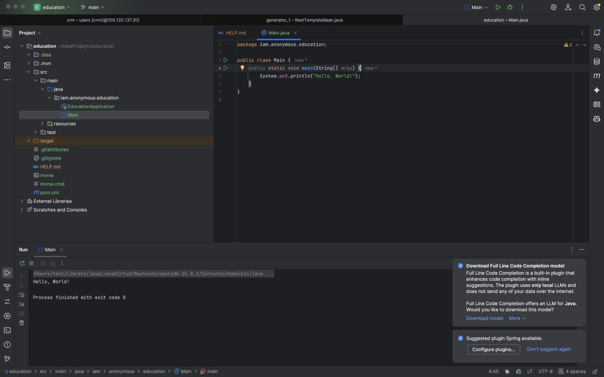
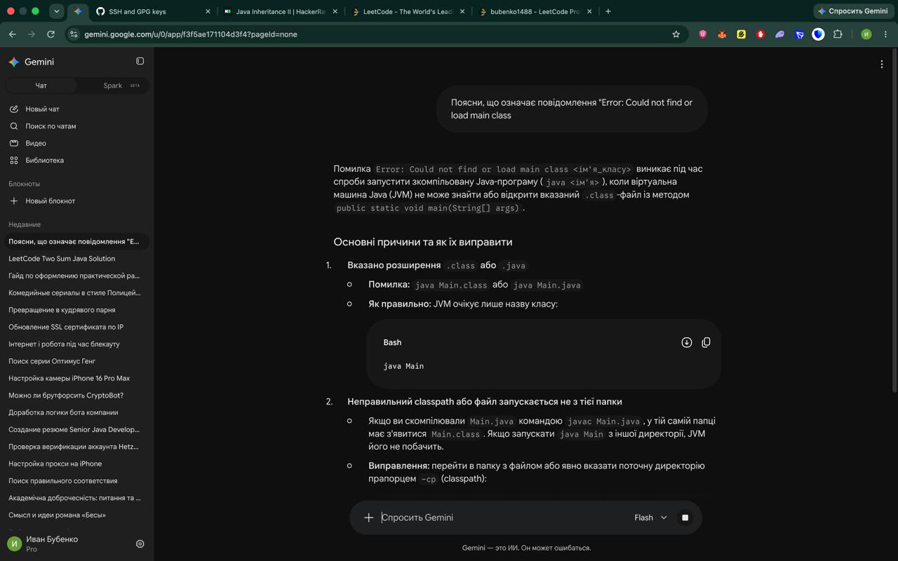
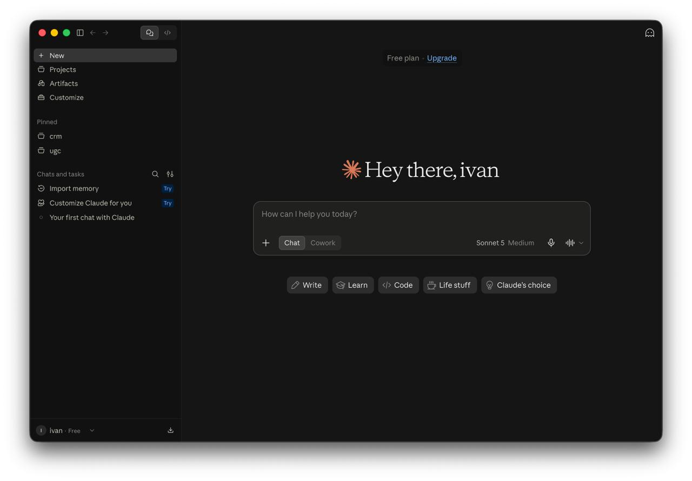

# Практичне заняття № 0. Підготовка робочого середовища розробника

* **Дисципліна:** Алгоритмізація та основи програмування
* **Студент:** Фоменко Іван Сергійович
* **Група:** Б2F201ДОН26

---

## 1. Профілі на платформах
* **GitHub:** https://github.com/phomenko1488
* **LeetCode:** https://leetcode.com/u/bubenko1488/
* **HackerRank:** https://www.hackerrank.com/profile/bubenko1488

---

## 2. Перевірка системного середовища та Git
Результати команд `java -version`, `javac -version`, `git --version`, `git config --global --list`:

---

## 3. Автентифікація GitHub через SSH
Результат перевірки зв'язку за допомогою команди `ssh -T git@github.com`:

---

## 4. Налаштування IntelliJ IDEA та запуск програми
Перший проєкт на базі Oracle JDK 25 із виконанням програми `Hello, World!`:

---

## 5. Виконання завдання на платформі HackerRank
Розв'язана задача «Welcome to Java!»:

---

## 6. Використання інструментів штучного інтелекту
### Gemini
Відповідь на навчальний запит щодо розбору помилки `Error: Could not find or load main class`:

### Claude Code
Виконання запиту в терміналі за допомогою CLI-асистента Claude Code:

## 7. Опис ускладнень та способи їх усунення
Під час підготовки робочого середовища складнощів не виникло. Усі компоненти (JDK 25, Git, SSH-ключі, IntelliJ IDEA) були успішно налаштовані та перевірені на сумісність.
*(Або опишіть реальну проблему, наприклад: конфлікт версій Java у PATH, права доступу до SSH-агента у Windows Terminal тощо).*